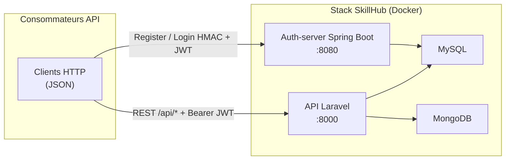

# SkillHub (EC06)

Plateforme **e-learning** mettant en relation **formateurs** et **apprenants** : catalogue de formations, modules, inscriptions, tableaux de bord et journalisation d’activité.

Ce dépôt regroupe l’**API métier Laravel**, le **micro-service d’authentification Spring Boot**, la **conteneurisation Docker** et le **pipeline CI/CD** (GitHub Actions + SonarCloud).

---

## Sommaire

1. [Description et architecture microservices](#1-description-et-architecture-microservices)  
2. [Authentification centralisée et JWT](#2-authentification-centralisée-et-jwt)  
3. [Règle métier — limite d’inscriptions (Q1)](#3-règle-métier--limite-dinscriptions-q1)  
4. [Installation et lancement avec Docker](#4-installation-et-lancement-avec-docker)  
5. [Outils : SonarCloud, GitHub Actions, Docker](#5-outils--sonarcloud-github-actions-docker)  
6. [Variables d’environnement](#6-variables-denvironnement)  
7. [Qualité logicielle — analyse et plan d’action](#7-qualité-logicielle--analyse-et-plan-daction)  
8. [Structure du dépôt](#8-structure-du-dépôt)  

---

## 1. Description et architecture microservices

SkillHub est découpé en **services** qui communiquent principalement en **HTTP/JSON** sur un réseau Docker dédié. La persistance métier (formations, inscriptions, modules) vit dans **MySQL** ; les **logs d’activité** sont stockés dans **MongoDB**. Les **consommateurs** des API (outils, scripts, intégrations) appellent Laravel pour le métier et l’auth-server pour l’obtention des jetons.

### Schéma logique



| Composant | Rôle |
|-----------|------|
| **Laravel (`api`)** | Règles métier, formations, modules, inscriptions, validation JWT. |
| **Auth-server (`auth-server`)** | Comptes utilisateurs (MySQL dédié `auth_db`), inscription, login **sans envoi du mot de passe en clair** (preuve HMAC), émission des **JWT**. |
| **MySQL** | Données applicatives SkillHub + base `auth_db` pour Spring. |
| **MongoDB** | Collection de logs / audit (`activity_logs`). |

---

## 2. Authentification centralisée et JWT

Imagine que **toutes les cartes d’identité** du système sont délivrées au même guichet : c’est le rôle du **micro-service Spring Boot** (souvent joignable en local sur le port **8080**). Là s’inscrivent les comptes, là on prouve qu’on connaît son mot de passe **sans l’envoyer en clair sur le fil**, et là l’on repart avec un **jeton JWT** — une sorte de badge signé qu’on présentera ensuite à l’API métier. Ce n’est pas un SSO d’entreprise au sens SAML, mais **un seul endroit** pour l’identité et les jetons, ce qui simplifie la vie de Laravel : **il ne garde pas le mot de passe** des utilisateurs pour ce flux-là, il se contente de **lire et de faire confiance au JWT** s’il est valide.

**Premier geste : créer un compte.** On envoie une requête `POST` vers `http://localhost:8080/api/auth/register` (en conditions Docker, l’hôte reste le même principe : le service d’auth écoute sur **8080**). Le corps est classique — par exemple en formulaire `x-www-form-urlencoded` avec l’**e-mail**, le **mot de passe** et le **rôle** (`apprenant` ou `formateur`). Spring vérifie la politique de mot de passe, enregistre l’utilisateur dans **sa** base (`auth_db`) et répond que l’inscription a bien eu lieu. Rien de magique : c’est le **tiroir des identités**, séparé du catalogue de formations qui vit côté Laravel.

**Ensuite : se connecter sans exposer le mot de passe.** Le client prépare un **nonce** (une valeur à usage limité), note l’**heure**, et assemble un petit message du type `email:nonce:timestamp`. Il calcule une **empreinte HMAC** (SHA-256) de ce message en utilisant le mot de passe comme secret — un peu comme dire « je connais le code, mais je ne le dicte pas à voix haute, je montre seulement une preuve cohérente avec ce code ». Cette empreinte part dans un `POST` vers `http://localhost:8080/api/auth/login` avec l’e-mail, le nonce et l’horodatage. Si la preuve est bonne, Spring répond en **200** avec un **`accessToken`** (le JWT), une date d’expiration et le type **`Bearer`**. À partir de là, le mot de passe peut rester sur la machine du client : **le réseau ne transporte que la preuve**, pas le secret.

**Enfin : utiliser l’API Laravel avec le même badge.** Le JWT a été signé côté Spring avec un secret partagé ; Laravel possède **exactement le même** `JWT_SECRET` et le même **`JWT_ISSUER`**, ce qui lui permet de **vérifier la signature et l’expiration** tout seul, dans le middleware `jwt.auth` (voir `App\Support\Jwt`). Concrètement, pour une route comme `GET http://localhost:8000/api/profile`, on ajoute l’en-tête `Authorization: Bearer <accessToken>`. Laravel décode le jeton, retrouve l’identifiant, l’e-mail et le rôle, et renvoie par exemple un objet `user` — **sans rappeler Spring à chaque requête**. C’est ce qui rend le flux **stateless** et léger : une fois le badge émis, le guichet d’identité peut se reposer ; c’est Laravel qui contrôle les accès au métier, toujours avec le même jeton.

---

## 3. Règle métier — limite d’inscriptions (Q1)

**Règle** : un **apprenant** ne peut pas être inscrit à **plus de cinq formations actives en parallèle**. Une formation est comptée tant qu’une ligne d’inscription existe pour cet utilisateur (les désinscriptions libèrent un « slot »).

**Implémentation** : `App\Http\Controllers\Api\EnrollmentController::store`.

- Avant création d’une inscription, le contrôleur compte les inscriptions existantes pour l’utilisateur authentifié.  
- Si le nombre est **≥ 5**, la réponse est **`400 Bad Request`** avec un message explicite du type : limite de cinq formations simultanées.  
- Les tests PHPUnit associés se trouvent dans `backend/tests/Feature/EnrollmentTest.php`.

**Endpoint modifié / concerné** (inscription apprenant) :

| Méthode | Chemin | Description |
|---------|--------|-------------|
| `POST` | `/api/formations/{formation}/inscription` | Inscription de l’apprenant connecté ; applique la limite de 5 formations. |

*(Routes déclarées dans `backend/routes/api.php`, groupe middleware `jwt.auth` + rôle apprenant.)*

---

## 4. Installation et lancement avec Docker

### Prérequis

- [Docker](https://docs.docker.com/get-docker/) et [Docker Compose](https://docs.docker.com/compose/) récents.

### Étapes

1. Cloner le dépôt et se placer à la **racine** (là où se trouvent `docker-compose.yml` et `.env.example`).  
2. Copier les variables d’environnement :  
   `cp .env.example .env`  
3. Renseigner les secrets dans **`.env`** (au minimum `APP_KEY` Laravel, `JWT_SECRET`, `APP_MASTER_KEY`, mots de passe MySQL/MongoDB — voir section suivante).  
4. Lancer la stack :  

```bash
docker compose up --build
```

5. Accès habituels (ports par défaut du compose) :  
   - API Laravel : **http://localhost:8000**  
   - Auth-server : **http://localhost:8080**  

Les services `api` et `auth-server` attendent que **MySQL** (et Mongo pour l’API) soient **healthy** ; le premier démarrage peut prendre une ou deux minutes.

---

## 5. Outils : SonarCloud, GitHub Actions, Docker

### SonarCloud — analyse de qualité

**SonarCloud** analyse le code source configuré dans le dépôt pour détecter **bugs**, **vulnérabilités**, **duplications**, **code smells** et suivre la **couverture de tests** lorsque les rapports (Clover, LCOV, JaCoCo, etc.) sont fournis par le pipeline.  
Le fichier `sonar-project.properties` à la racine définit les chemins sources, tests et rapports de couverture.  
L’analyse est déclenchée dans GitHub Actions avec le secret **`SONAR_TOKEN`** (pas de jeton en clair dans le dépôt).

### GitHub Actions — CI/CD

Le workflow **`.github/workflows/ci.yml`** :

- se déclenche sur les pushes et pull requests vers **`main`** et **`dev`** ;  
- installe les dépendances, exécute le **lint**, les **tests automatisés**, l’analyse **SonarCloud**, puis **construit** les images Docker taguées par le SHA Git ;  
- sur **`main`** uniquement, pousse les images vers une **registry** en utilisant les secrets **`REGISTRY_USER`** et **`REGISTRY_TOKEN`**.

### Docker — conteneurisation

Chaque partie de la stack possède un **Dockerfile** ; **`docker-compose.yml`** orchestre les services, le réseau `skillhub_net`, les **healthchecks** et les **volumes** persistants (données MySQL et MongoDB). Cela garantit un environnement **reproductible** entre développeurs et intégration continue.

---

## 6. Variables d’environnement

Le fichier **`.env.example`** à la **racine** du dépôt documente les variables pour :

- **Laravel** (via `env_file: .env` du service `api`) ;  
- **MySQL / MongoDB** (valeurs partagées avec les services `db` / `mongodb`) ;  
- **Auth-server** (`JWT_*`, `APP_MASTER_KEY`, datasource Spring injectée ou surchargée par `docker-compose.yml`).

**À faire localement** : copier `.env.example` vers `.env`, générer une **`APP_KEY`** Laravel (ex. `php artisan key:generate` dans le conteneur ou hors Docker), et définir des secrets forts pour **`JWT_SECRET`** (≥ 32 caractères), **`APP_MASTER_KEY`**, et les mots de passe bases de données.

---

## 7. Qualité logicielle — analyse et plan d’action

L’analyse **SonarCloud** sur le dépôt (après intégration de la feature « limite d’inscriptions » sur `main`) permet de croiser **fiabilité**, **sécurité**, **maintenabilité**, **couverture** et **duplications**. Les sections suivantes ne modifient pas le code : elles proposent un **plan d’amélioration** aligné sur un constat précis remonté par l’outil.

### 7.1 Constat — données non sûres écrites dans le stockage navigateur (Sonar `jssecurity:S8475`)

Sonar signale une règle du type **« Ensure that tainted data is sanitized before being written to browser storage »** : tout ce qui est placé dans **`localStorage`**, **`sessionStorage`** ou **`IndexedDB`** reste disponible pour **tout le JavaScript du même origine**, et survit aux rechargements de page. Si l’on y enregistre des valeurs **issues de l’extérieur** (réponses API, paramètres d’URL, champs utilisateur) **sans les traiter**, on risque une **empoisonnement du stockage** (*storage poisoning*) : plus tard, un autre module — ou un développeur qui croit la donnée « interne » — la relit et l’utilise dans un **rendu DOM**, une **construction d’URL** ou un **appel API**, ce qui ouvre la voie à des abus **indirects** (XSS persistant côté client, corruption d’état à côté des jetons ou préférences, exploitation **cross-page** car le stockage est partagé entre toutes les pages du même site).

### 7.2 Plan d’action proposé (priorisé, sans implémentation dans ce livrable)

1. **Cartographier les écritures**  
   Lister tous les chemins qui écrivent dans `localStorage`, `sessionStorage` ou `IndexedDB` (recherche dans le code, revue de PR). Pour chaque clé, noter **l’origine** de la valeur (API, formulaire, URL, constante).

2. **Valider avant d’écrire (liste blanche)**  
   Lorsque la donnée doit respecter un format connu (rôle, identifiant, booléen, énumération), la comparer à une **liste blanche** de valeurs attendues **avant** persistance. Ne pas se contenter d’une hygiène « à la lecture » : le code qui lit plus tard peut être ailleurs, ou ajouté plus tard, et supposer à tort que le stockage est sûr.

3. **Assainir explicitement avant stockage**  
   Pour les chaînes libres (noms affichés, libellés, etc.), appliquer une **sanitisation ou normalisation** au moment de l’écriture (échappement, suppression de balises, troncature contrôlée, format imposé), selon le contrat métier. Éviter de persister du **HTML brut**, des **URL non validées** ou des **objets complexes** provenant de sources non fiables sans schéma strict (JSON validé, types bornés).

4. **Réduire ce qui est stocké**  
   Préférer, quand c’est possible, de ne **pas** dupliquer dans le navigateur des données riches ou sensibles : garder un **identifiant** ou un **résumé** vérifiable côté serveur, plutôt qu’un miroir complet de réponses API « comme reçues ».

5. **Documenter le contrat par clé**  
   Pour chaque entrée de stockage, une courte **fiche** : type attendu, origine, lecteurs connus, garanties (ou absence de garantie). Cela limite les mauvaises suppositions futures.

6. **Contrôles de non-régression**  
   Après correction : revue de code ciblée, tests manuels ou automatisés sur les scénarios « écriture puis lecture dans un autre écran », et revérification SonarCloud sur la même règle **S8475**.

Ce plan reste **générique** par rapport à la stack : il s’applique à tout code JavaScript exécuté dans le navigateur qui persiste des données. Les autres indicateurs Sonar (couverture, duplications, dette) pourront être suivis de la même manière : **constat → priorisation → actions mesurables**.

---

## 8. Structure du dépôt

```text
.
├── .github/workflows/       # CI/CD (GitHub Actions)
├── auth-server/             # Micro-service Spring Boot (JWT, HMAC login)
├── backend/                 # API Laravel
├── docker/                  # Scripts SQL d’init MySQL, etc.
├── docker-compose.yml
├── sonar-project.properties # Configuration SonarCloud
├── .env.example             # Modèle des variables (Laravel + Spring + infra)
└── README.md                # Ce document
```

---

## Documentation complémentaire

- Backend : `backend/README.md`  
- OpenAPI : `backend/docs/openapi.yaml`  
